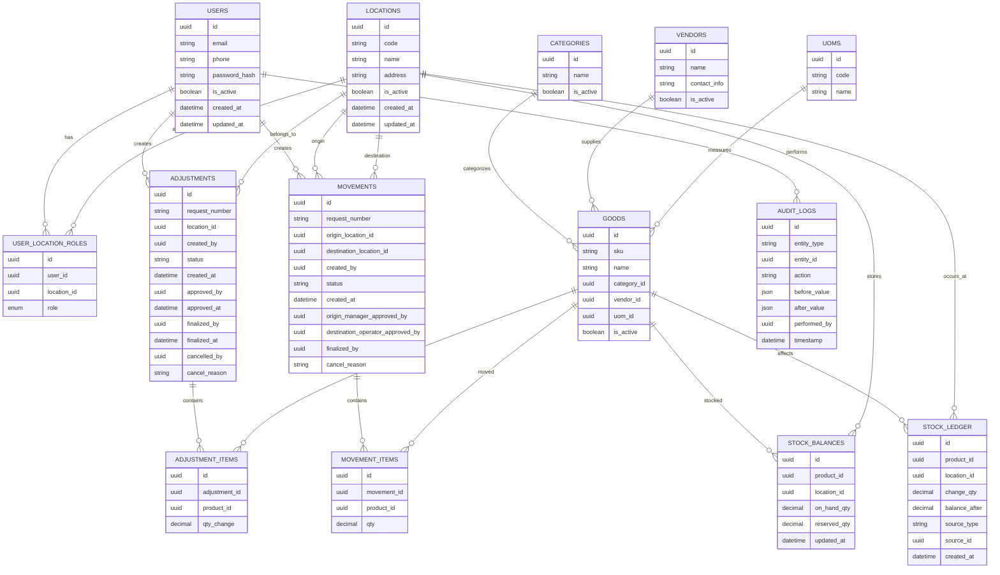

# Asset Management System — Product Specification (V1)

## 1. Product Overview

### Objective

Build an internal inventory management system for a single company with multiple warehouse locations.

The system manages:

- Product master data
- Stock levels per location
- Stock adjustments
- Stock movements between locations
- Approval workflows
- Audit tracking

### Key Principles

1. Stock changes only occur when requests are finalized
2. All stock changes must be recorded in an immutable ledger
3. Approval workflows must be enforced
4. Stock reservation prevents overselling
5. Every action must be auditable

---

# 2. Technology Stack

## Backend

- Node.js
- Express.js
- Prisma ORM
- MySQL
- JWT Authentication
- bcrypt password hashing

## Frontend

- React
- TypeScript
- Vite
- Material UI
- TanStack Query
- React Hook Form
- Zod validation

## Architecture

Frontend (React) → REST API Backend (Node.js + Express) → MySQL Database

## Project Structure

### Backend

```
/backend
  /src
    /modules
      auth
      users
      goods
      vendors
      categories
      locations
      stock
      adjustments
      movements
      audit
```

### Frontend

```
/frontend
  /src
    /modules
      auth
      dashboard
      goods
      stock
      adjustments
      movements
      admin
      audit
```

---

# 3. Core Domain Entities

## Goods

Fields:

- id (UUID)
- sku (unique)
- name
- category\_id
- vendor\_id
- uom\_id
- is\_active
- created\_at
- updated\_at

Rules:

- SKU must be unique
- Name may be duplicated
- Goods cannot be deleted
- Only deactivated

---

## Vendor

Fields:

- id
- name
- contact\_info
- is\_active
- created\_at
- updated\_at

Rules:

- Cannot delete if referenced by goods

---

## Category

Fields:

- id
- name
- is\_active
- created\_at
- updated\_at

Rules:

- Cannot delete if referenced

---

## Unit of Measurement

Fields:

- id
- code
- name

Examples:

- PCS
- BOX
- KG

---

## Location

Fields:

- id
- code
- name
- address
- is\_active
- created\_at
- updated\_at

Rules:

- Cannot delete
- Only deactivate

---

## User

Fields:

- id
- email
- phone
- password\_hash
- is\_active
- created\_at
- updated\_at

Login identifier:

- email OR phone

---

## User Location Role

Table: user\_location\_roles

Fields:

- id
- user\_id
- location\_id
- role

Roles:

- OPERATOR
- MANAGER

Constraints:

- One role per user per location

---

# 4. Role Permissions

## Operator

Allowed actions:

- Create stock adjustment
- Create movement request
- Finalize adjustment
- Approve movement (destination)
- Finalize movement (destination)
- Cancel requests

---

## Manager

Allowed actions:

- Approve adjustments
- Approve movement (origin)
- Finalize adjustments
- Cancel requests
- View stock

---

## Admin

Global role.

Allowed actions:

- Manage goods
- Manage vendors
- Manage categories
- Manage locations
- Manage users
- View stock across locations
- View all requests

Admin cannot approve requests.

---

# 5. Stock Model

Stock is tracked per:

- product
- location

Table: stock\_balances

Fields:

- id
- product\_id
- location\_id
- on\_hand\_qty
- reserved\_qty
- updated\_at

Derived value:

available\_qty = on\_hand\_qty - reserved\_qty

---

# 6. Stock Ledger (Immutable)

Table: stock\_ledger

Fields:

- id
- product\_id
- location\_id
- change\_qty
- balance\_after
- source\_type
- source\_id
- created\_at

Source types:

- ADJUSTMENT
- MOVEMENT\_IN
- MOVEMENT\_OUT

Rules:

- Ledger entries are immutable
- Never edited
- Never deleted

---

# 7. Stock Adjustment Module

## Adjustment Request

Table: adjustments

Fields:

- id
- request\_number
- location\_id
- created\_by
- status
- created\_at
- approved\_by
- approved\_at
- finalized\_by
- finalized\_at
- cancelled\_by
- cancel\_reason

Statuses:

- DRAFT
- SUBMITTED
- MANAGER\_APPROVED
- READY\_TO\_FINALIZE
- FINALIZED
- CANCELLED

---

## Adjustment Items

Table: adjustment\_items

Fields:

- id
- adjustment\_id
- product\_id
- qty\_change

Rules:

- qty\_change may be positive or negative
- No duplicate product per request

---

# 8. Stock Movement Module

## Movement Request

Table: movements

Fields:

- id
- request\_number
- origin\_location\_id
- destination\_location\_id
- created\_by
- status
- created\_at
- origin\_manager\_approved\_by
- destination\_operator\_approved\_by
- finalized\_by
- cancel\_reason

Statuses:

- DRAFT
- SUBMITTED
- ORIGIN\_MANAGER\_APPROVED
- DESTINATION\_OPERATOR\_APPROVED
- READY\_TO\_FINALIZE
- FINALIZED
- CANCELLED

---

## Movement Items

Table: movement\_items

Fields:

- id
- movement\_id
- product\_id
- qty

Rules:

- No duplicate product per request
- qty must be positive

---

# 9. Stock Reservation Logic

Reservation occurs when request status = SUBMITTED

Logic:

If available\_qty < requested\_qty → reject request

Reservation released when:

- request cancelled
- request finalized

---

# 10. Movement Finalization Logic

When finalized:

Origin location

- on\_hand -= qty
- reserved -= qty

Destination location

- on\_hand += qty

Two ledger entries created:

- MOVEMENT\_OUT
- MOVEMENT\_IN

Both must be executed in a single database transaction.

---

# 11. Stock Dashboard

Default period: current calendar month

Dashboard shows:

- product
- starting\_qty
- inbound
- outbound
- pending\_inbound
- pending\_outbound
- final\_qty

Rules:

- inbound/outbound = finalized transactions only
- pending = approved but not finalized

Users with single location see only that location.

Users with multiple locations can filter.

Admins see all.

---

# 12. Request Tables

Adjustment and movement modules show:

- request\_number
- location
- status
- created\_by
- created\_at
- approved\_by
- finalized\_by

Pagination:

- default page size = 20

---

# 13. Audit Logging

Table: audit\_logs

Fields:

- id
- entity\_type
- entity\_id
- action
- before\_value
- after\_value
- performed\_by
- timestamp

Tracked actions:

- CREATE
- UPDATE
- DELETE
- STATUS\_CHANGE
- LOGIN
- LOGOUT

Stock module also provides views for:

- adjustment logs
- movement logs

---

# 14. API Design

## Auth

- POST /auth/login
- POST /auth/logout

## Goods

- GET /goods
- POST /goods
- PUT /goods/\:id

## Stock

- GET /stock
- GET /stock/ledger

## Adjustments

- POST /adjustments
- GET /adjustments
- POST /adjustments/\:id/submit
- POST /adjustments/\:id/approve
- POST /adjustments/\:id/finalize
- POST /adjustments/\:id/cancel

## Movements

- POST /movements
- POST /movements/\:id/submit
- POST /movements/\:id/origin-approve
- POST /movements/\:id/destination-approve
- POST /movements/\:id/finalize
- POST /movements/\:id/cancel

---

# 15. Security

Authentication:

- JWT access token
- refresh token

Passwords:

- bcrypt hashing

All APIs must verify the user location role before allowing actions.

---

# 16. AI Guardrails

AI must NOT:

- Modify stock outside finalized requests
- Edit ledger records
- Allow duplicate products in requests
- Allow negative available stock
- Skip approval workflows

AI must ALWAYS:

- Wrap stock updates in database transactions
- Validate stock reservation
- Record audit logs

---

# 17. AI Implementation Order

Phase 1

- Database schema
- Prisma models

Phase 2

- Authentication
- Users
- Locations
- Roles

Phase 3

- Master data
- Goods
- Vendors
- Categories
- UOM

Phase 4

- Stock balances
- Stock ledger
- Stock dashboard

Phase 5

- Stock adjustment module

Phase 6

- Stock movement module
- Reservation system

Phase 7

- Audit log
- Admin panels

---

# 18. Future Features (Not in V1)

- Barcode scanning
- Purchase orders
- Sales orders
- Batch tracking
- Stock opname
- Attachments

---

# 19. Entity Relationship Diagram (ERD)

The following ERD represents the core database structure for V1.



## ERD Design Notes

Key structural decisions:

- **Stock balances** store the current quantity per product per location.
- **Stock ledger** stores immutable historical records of every stock change.
- **Adjustments** and **movements** act as workflow entities that eventually generate ledger entries.
- **Adjustment items** and **movement items** allow multiple products per request.
- **User-location roles** enable mu
